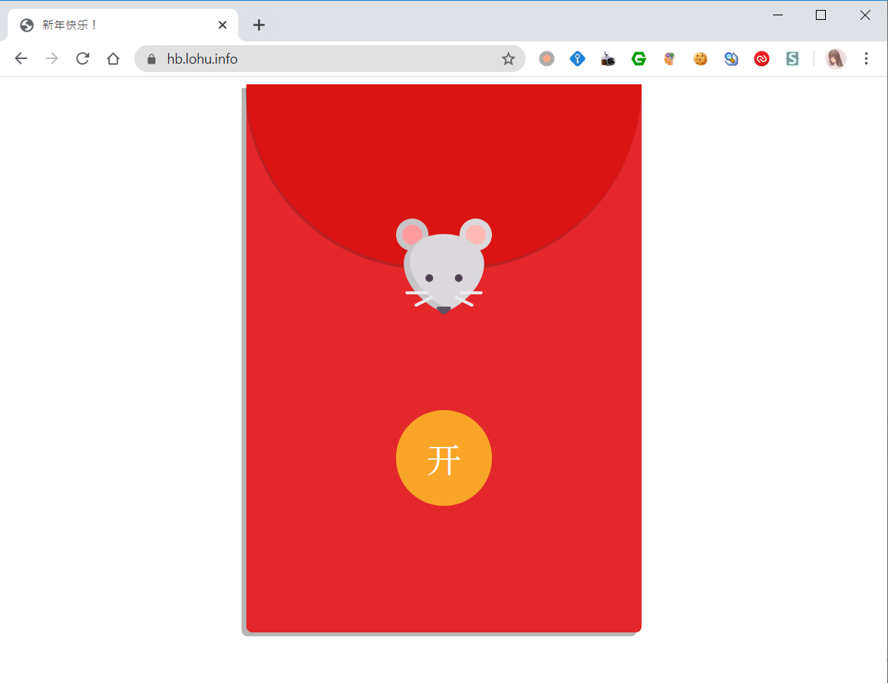
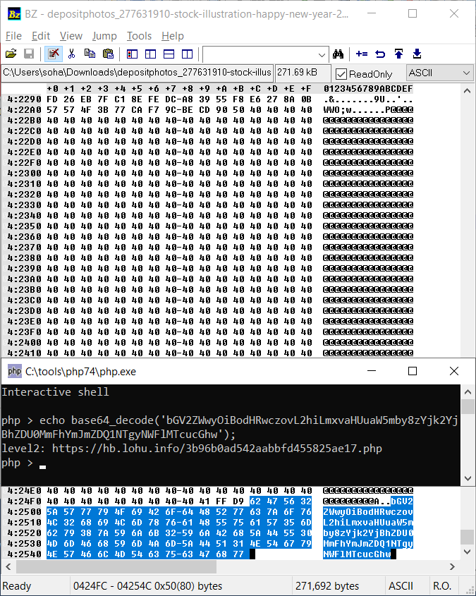
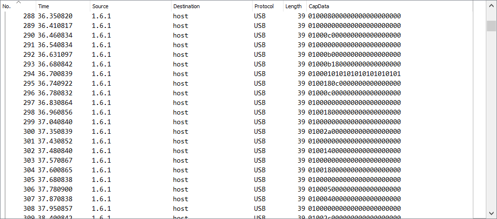

因为去年题目只有两个人做出来，所以今年大幅降低了难度。



### 0x01 第一关


第一关点击“开”按钮，就出现了一张图片。将这张图片下载下来。使用二进制查看器打开，可以在最后看到一串 base64 编码的神秘代码。解码可得通往第二关的 URL。



### 0x02 第二关


第二关是一个神秘的系统，首先告诉了你一个账号，我们用这个账号试试。


并没有用，还被嘴臭了一番……不过它提示了我们要用“admin”去登录，但是不知道密码，该怎么办呢？遇事不决查看源代码。


发现了有调试信息没有删除，由此可知，数据库是 MongoDB。在开发的时候很容易遇到的一个问题就是注入，而 MongoDB 可以使用形如 `fieldName: { $condition: value }` 的方式来查询，如果后端没有对这里进行检查，而是直接使用 `$_POST['field']` 的话就会被注入。那么我们将密码的 name 属性改成 `password[$ne]`，`$ne` 就是 MongoDB 中的不等于。


现在提交就能进入系统了。并获得第一份红包口令，以及下一关的地址。


### 0x03 第三关

第三关下载的是一个 bin 文件。观察得知这是一个 gzip 压缩过的文件，里面是一个 pcapng 文件。解压后将其丢进 Wireshark。


可见这是一个对 USB 进行抓包得到的数据。虽然没说这是啥，但是看包大小，以及直觉可以猜测应该是键盘鼠标等 HID 设备的数据。实际上就是对我的 Type Cover 进行抓包得到的。这个包里只有单纯的数据，没有设备刚插上的时候的初始化数据，所以什么是键盘什么是触摸板的数据，就得靠自己分析了。

触摸板一般是短时间内连续十分多的（表现出连续性的），像这些 0x04 开头的应该就是触摸板了。


这种两个一组的，第一个字节 0x01 的，第三个字节一下子是 0x00 一下子是另一个值的，就是键盘的数据了。



用 `usb.capdata[0]==0x01` 在 Wireshark 中筛选出来，然后将余下的包导出为 CSV 或者 JSON 方便后续进行数据处理。


虽然各个厂商的数据结构可能不一样，但是键盘键位对应的值是确定的，规定在 HID Usage Table 里面。第三个字节呢对应的就是键盘上的键位，第二个字节则是 Shift、Alt 之类的键位。于是可以写出这样的代码来解析数据：

```javascript
const fs=require('fs');

const data=JSON.parse(fs.readFileSync('keyboard_packets.json').toString());
const keyboardPackets=data.map(o => o._source.layers['usb.capdata'].split(':').map(n => parseInt(n, 16)));

const _MODKEY=[
	[0x01, "LCtrl"],
	[0x02, "LShift"],
	[0x04, "LAlt"],
	[0x08, "LMeta"],
	[0x10, "RCtrl"],
	[0x20, "RShift"],
	[0x40, "RAlt"],
	[0x80, "RMeta"],
];
const _KEY=[
	null, 'ErrorRollOver', 'POSTFail', 'ErrorUndefined',
	'a', 'b', 'c', 'd', 'e', 'f', 'g', 'h', 'i', 'j', 'k', 'l', 'm',
	'n', 'o', 'p', 'q', 'r', 's', 't', 'u', 'v', 'w', 'x', 'y', 'z',
	'1', '2', '3', '4', '5', '6', '7', '8', '9', '0',
	'Enter', 'ESC', 'Backspace', 'Tab', 'Space',
	'-', '=', '[', ']', '\\', '`', ';', '\'', 'GraveAccent', ',', '.', '/',
	'CapsLock', 'F1', 'F2', 'F3', 'F4', 'F5', 'F6', 'F7', 'F8', 'F9', 'F10', 'F11', 'F12',
	'PrintScreen', 'ScrollLock', 'Pause', 'Insert', 'Home', 'PageUp', 'DeleteForward', 'End', 'PageDown',
	'RIGHT', 'LEFT', 'DOWN', 'UP', // Keyboard all here
];

const outputBuffer = []
keyboardPackets.forEach((d, i, a) => {
	const mod=d[1], key=d[2];
	if(!mod && !key){
		return; // this packet is empty
	}
	const nextPacket=a[i+1] || [];
	if(nextPacket[1] == mod && !key && !!nextPacket[2]){
		return; // this key with mod key is not finished
	}
	const keyNames=_MODKEY.filter(([code]) => mod & code).map(([_,name]) => name);
	
	if(_KEY[key] !== null){
		keyNames.push(_KEY[key]);
		if(keyNames.length === 1 && keyNames[0].length === 1){
			outputBuffer.push(keyNames[0]);
		}else{
			outputBuffer.push(`<${keyNames.filter(o => o !== null).join('+')}>`);
		}
	}
});
console.log(outputBuffer.join(''));
```

最后可以分析数据，发现这里有 https，后面跟了一个 URL。将后面那个目录拉出来塞进去就行了。（这里我特意打得特别慢，怕抖动导致包不对）


### 0x04 第四关

访问那个目录，得到第四关的信息：


dig 可得一个 IPv6 地址。这个地址的最后半部分就是一个八位的数字，就是红包口令。

